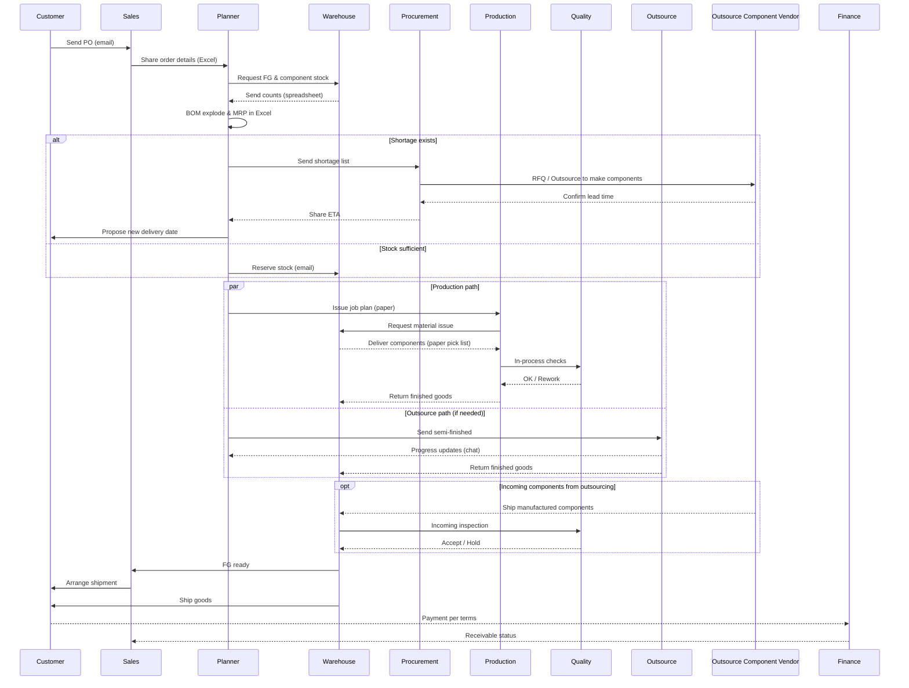

# As-Is Business Flow (Current Operations) - Mermaid

This document visualizes how the client likely operates today based on the problem statements: manual checks, spreadsheet reliance, delayed material visibility, and coordination frictions across teams.

---

## 1) High-Level As-Is Flow (Manual, Spreadsheet-Driven)

```mermaid
flowchart LR
    A["Customer sends PO email/excel"] --> B["Sales records PO in spreadsheet"]
    B --> C["Sales verifies BOM codes manually"]
    C --> D{"Check finished goods stock?"}
    D -- Manually check stock list --> E["Warehouse sends stock figure via chat/email"]
    D -- No system view --> E
    E --> F{"Enough BOM to fulfill?"}
    F -- Yes --> G["Reserve stock informally email"]
    G --> H["Arrange shipment manually"]
    H --> I["Deliver to customer"]
    I --> J["Finance issues invoice"]
    F -- No --> K["Planner calculates shortage in Excel"]
    K --> L["Planner explodes BOM manually"]
    L --> M["Planner checks semi-finished availability"]
    M --> N["Planner checks component availability"]
    N --> O{"Can in-house make enough components on time?"}
    O -- Yes --> P["Create internal production plan Excel"]
    O -- No --> Q["Procurement raises outsource PO for components"]
    Q --> OC1["Send outsource RFQ/PO to component vendor"]
    OC1 --> OC2["Vendor confirms tentative lead time"]
    OC2 --> OC3["Receive outsourced components"]
    OC3 --> P
    P --> PD{"In-house or outsource processing for semi/finished?"}
    PD -- "In-house" --> W["Issue components paper pick list"]
    PD -- Outsource --> XO1["Transfer materials/semi-finished to outsource"]
    XO1 --> XO2["Outsource processing"]
    XO2 --> XO3["Receive goods from outsource"]
    XO3 --> Y["Quality checks paper forms"]
    W --> X["Production starts; daily progress via chat"]
    X --> Y
    Y --> Z{"Pass quality?"}
    Z -- Yes --> AA["Move to finished goods area"]
    Z -- No --> AB["Rework / scrap logged manually"]
    AA --> AC["Warehouse updates spreadsheet inventory"]
    AC --> AD["Prepare shipment phone+email"]
    AD --> I

     A:::manual
     B:::manual
     C:::manual
     D:::decision
     E:::manual
     F:::decision
     G:::manual
     H:::manual
     I:::manual
     J:::manual
     K:::manual
     L:::manual
     M:::manual
     N:::manual
     O:::decision
     P:::manual
     Q:::manual
     OC1:::manual
     OC2:::manual
     OC3:::manual
     PD:::decision
     W:::manual
     XO1:::manual
     XO2:::manual
     XO3:::manual
     Y:::manual
     X:::manual
     Z:::decision
     AA:::manual
     AB:::manual
     AC:::manual
     AD:::manual
    classDef manual fill:#fff3e0,stroke:#ef6c00,stroke-width:2px
    classDef decision fill:#ffebee,stroke:#c62828,stroke-width:2px
```



---

## 2) Role-Based Swimlanes (Departments and Handoffs)

```mermaid
flowchart TB
    subgraph Sales
      S1[Receive PO via email]
      S2[Enter PO into spreadsheet]
      S3[Confirm pricing/terms offline]
      S4[Coordinate with Planning]
    end

    subgraph Planning
      P1[Check FG stock with Warehouse]
      P2[Explode BOM in Excel]
      P3[Check semi-finished availability]
      P4[Check component availability]
      P5[Estimate capacity (manual)]
      P6[Propose delivery date]
    end

    subgraph Warehouse
      W1[Provide stock counts (Excel)]
      W2[Reserve stock via email note]
      W3[Issue components with paper list]
      W4[Receive FG and update spreadsheet]
      W5[Pick, pack, stage shipment]
    end

    subgraph Procurement
      PR1[Collect shortages from Planning]
      PR2[Request quotes to outsource vendors]
      PR3[Create outsource PO in Excel/ERP-lite]
      PR4[Send outsource PO for components]
      PR5[Chase confirmations]
    end

    subgraph Production
      M1[Schedule jobs (whiteboard)]
      M2[Run production]
      M3[Report progress (chat/photo)]
    end

    subgraph Outsource
      O1[Receive semi-finished transfer]
      O2[Process to finished/semi]
      O3[Return goods]
    end

    subgraph Outsource Component Vendor
      OCV1[Confirm lead time]
      OCV2[Manufacture components]
      OCV3[Ship components]
    end

    subgraph Quality
      Q1[Inspect incoming materials]
      Q2[In-process checks]
      Q3[Final inspection]
      Q4[Record defects on paper]
    end

    subgraph Finance
      F1[Issue invoice after ship]
      F2[Track payments in accounting]
    end

    subgraph Management
      MG1[Request status updates]
      MG2[Review ad-hoc spreadsheets]
      MG3[Escalate delays]
    end

  %% Flows (components only via outsourcing)
    S1 --> S2 --> S3 --> S4
    S4 --> P1
    P1 --> W1 --> P2
    P2 --> P3 --> P4 --> P5 --> P6
  P6 -->|If shortage| PR1 --> PR2 --> PR3 --> PR4 --> PR5 --> OCV1 --> OCV2 --> OCV3 --> W1
    P6 -->|If production (in-house)| M1 --> M2 --> Q2 --> M3 --> W4
    P6 -->|If outsource processing| O1 --> O2 --> O3 --> W4
    W3 --> M2
    W4 --> Q3
    Q1 --> W4
    Q3 --> W5 --> F1 --> F2
    MG1 --> MG2 --> MG3
```

---

## 3) Sequence Diagram (Typical Order with Shortage)



---

## 4) Pain Points Highlight Overlay

```mermaid
flowchart TD
    A1[Manual data entry across spreadsheets]:::pain
    A2[No real-time inventory visibility]:::pain
  A3[Lead time uncertainty from outsourcing vendors]:::pain
    A4[Capacity planning guesswork]:::pain
    A5[Informal reservations cause conflicts]:::pain
    A6[Scattered communications (email/chat/phone)]:::pain
    A7[Delayed quality feedback loops]:::pain
    A8[Management lacks consolidated dashboard]:::pain

    classDef pain fill:#ffebee,stroke:#c62828,stroke-dasharray: 5 5,stroke-width:2px
```

---

### Notes
- As-Is reflects dependence on emails, spreadsheets, and manual reconciliation.
- Stock states (Available vs Reserved) are tracked ad-hoc, creating double-booking risks.
- Material Available Date and Delivery promises rely on rough estimates.
- Outsource integration is status-by-message, not system-tracked.
- Reporting requires collecting disparate files, resulting in delays.

---

## Assumptions vs Confirmed (to avoid made-up info)

Confirmed from Requirement Collection:
- Client does production and uses outsource partners; outsource integrates into production planning (Module 4.3).
- Inventory issues: inaccurate stock, need to distinguish Available vs Locked/Reserved.
- Lead times affect material available date and delivery date commitments.
- Current pain points include manual processes and lack of dashboards/real-time visibility.
- Your clarification: Components cannot be bought; they are obtained only via outsourcing to component vendors.

Assumptions to Validate (TBC):
- The specific tools used today (email/chat/phone, spreadsheets, paper pick lists, whiteboard scheduling) are examples representing "manual" flows.
- For outsourced component manufacturing, whether raw materials are supplied by you or sourced by the vendor is not specified; the diagram abstracts this.
- Quality documentation (incoming/in-process/final) is assumed paper-based.
- Invoicing timing after shipment follows typical practice; please confirm your current process.
