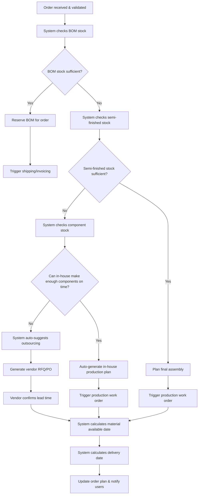

# Business Flow: Automated Order Analysis & Planning (Mermaid)

---

## Key Automation Points
- System checks all stock levels in real time
- Prioritizes in-house production; outsources only if needed
- Automatically generates work orders and vendor RFQs/POs
- Calculates material available and delivery dates
- Notifies users of plan, exceptions, and changes
