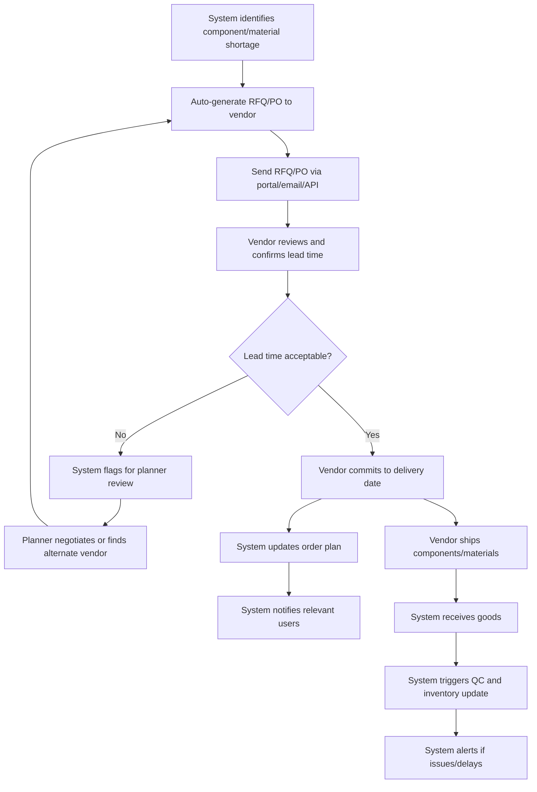

# Business Flow: Procurement & Outsourcing (Mermaid)

---

## Key Automation Points
- RFQ/PO generation and sending is automatic
- Vendor lead time and delivery confirmation is tracked digitally
- System flags exceptions and supports alternate vendor selection
- Goods receipt, QC, and inventory update are automated
- Notifications and alerts for all relevant events
