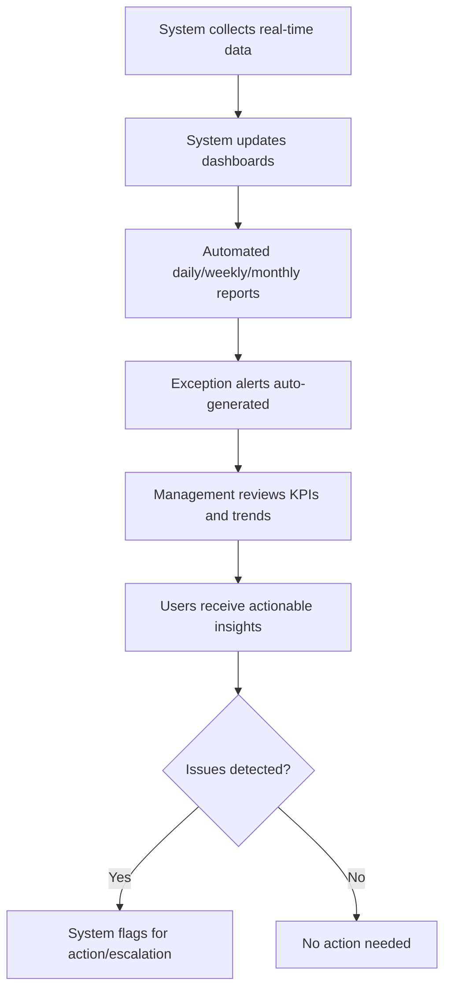

# Business Flow: Reporting & Dashboards (Mermaid)

---

## Key Automation Points
- Dashboards and reports are updated in real time
- Exception alerts are automated
- Management and users receive actionable insights
- Issues are flagged for action or escalation
