# As-Is Business Flow (Current Operations) - Mermaid

This document visualizes how the client likely operates today based on the problem statements: manual checks, spreadsheet reliance, delayed material visibility, and coordination frictions across teams.

---

## 1) High-Level As-Is Flow (Manual, Spreadsheet-Driven)

```mermaid
flowchart TD
    A[Customer sends PO email/excel] --> B[Sales records PO in spreadsheet]
    B --> C[Sales verifies BOM codes manually]
    C --> D{Check finished goods stock?}
    D -->|Manually check stock list| E[Warehouse sends stock figure via chat/email]
    D -->|No system view| E
    E --> F{Enough BOM to fulfill?}
    F -->|Yes| G[Reserve stock informally email]
    G --> H[Arrange shipment manually]
    H --> I[Deliver to customer]
    I --> J[Finance issues invoice]
    
    F -->|No| K[Planner calculates shortage in Excel]
    K --> L[Planner explodes BOM manually]
    L --> M[Planner checks semi-finished availability]
    M --> N[Planner checks component availability]
    N --> O{Can in-house make enough components on time?}
    O -->|Yes| P[Create internal production plan Excel]
    O -->|No| Q[Procurement raises outsource PO for components]
    Q --> OC1[Send outsource RFQ/PO to component vendor]
    OC1 --> OC2[Vendor confirms tentative lead time]
    OC2 --> OC3[Receive outsourced components]
    OC3 --> P
    
    P --> PD{In-house or outsource processing for semi/finished?}
    PD -->|In-house| W[Issue components paper pick list]
    PD -->|Outsource| XO1[Transfer materials/semi-finished to outsource]
    XO1 --> XO2[Outsource processing]
    XO2 --> XO3[Receive goods from outsource]
    XO3 --> Y[Quality checks paper forms]
    W --> X[Production starts; daily progress via chat]
    X --> Y
    Y --> Z{Pass quality?}
    Z -->|Yes| AA[Move to finished goods area]
    Z -->|No| AB[Rework / scrap logged manually]
    
    AA --> AC[Warehouse updates spreadsheet inventory]
    AC --> AD[Prepare shipment phone+email]
    AD --> I

    classDef manual fill:#fff3e0,stroke:#ef6c00,stroke-width:2px
    classDef decision fill:#ffebee,stroke:#c62828,stroke-width:2px
    class A,B,C,E,G,H,I,J,K,L,M,N,P,Q,OC1,OC2,OC3,W,X,Y,AA,AB,AC,AD,XO1,XO2,XO3 manual
    class D,F,O,Z,PD decision
```

---

### Notes
- As-Is reflects dependence on emails, spreadsheets, and manual reconciliation.
- Stock states (Available vs Reserved) are tracked ad-hoc, creating double-booking risks.
- Material Available Date and Delivery promises rely on rough estimates.
- Outsource integration is status-by-message, not system-tracked.
- Reporting requires collecting disparate files, resulting in delays.

---

## Assumptions vs Confirmed (to avoid made-up info)

Confirmed from Requirement Collection:
- Client does production and uses outsource partners; outsource integrates into production planning (Module 4.3).
- Inventory issues: inaccurate stock, need to distinguish Available vs Locked/Reserved.
- Lead times affect material available date and delivery date commitments.
- Current pain points include manual processes and lack of dashboards/real-time visibility.
- Your clarification: Components cannot be bought; they are obtained only via outsourcing to component vendors.

Assumptions to Validate (TBC):
- The specific tools used today (email/chat/phone, spreadsheets, paper pick lists, whiteboard scheduling) are examples representing "manual" flows.
- For outsourced component manufacturing, whether raw materials are supplied by you or sourced by the vendor is not specified; the diagram abstracts this.
- Quality documentation (incoming/in-process/final) is assumed paper-based.
- Invoicing timing after shipment follows typical practice; please confirm your current process.
