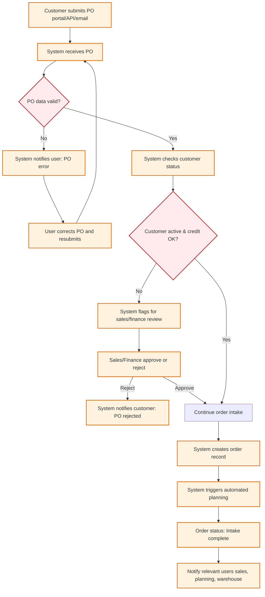

# Business Flow: Customer Order Intake (Mermaid)

---

## Key Automation Points
- PO validation is automatic (required fields, format, duplicates)
- Customer status and credit check are system-driven
- Exception handling for invalid PO or customer issues
- Order record creation and planning trigger are automated
- Notifications sent to all relevant roles
