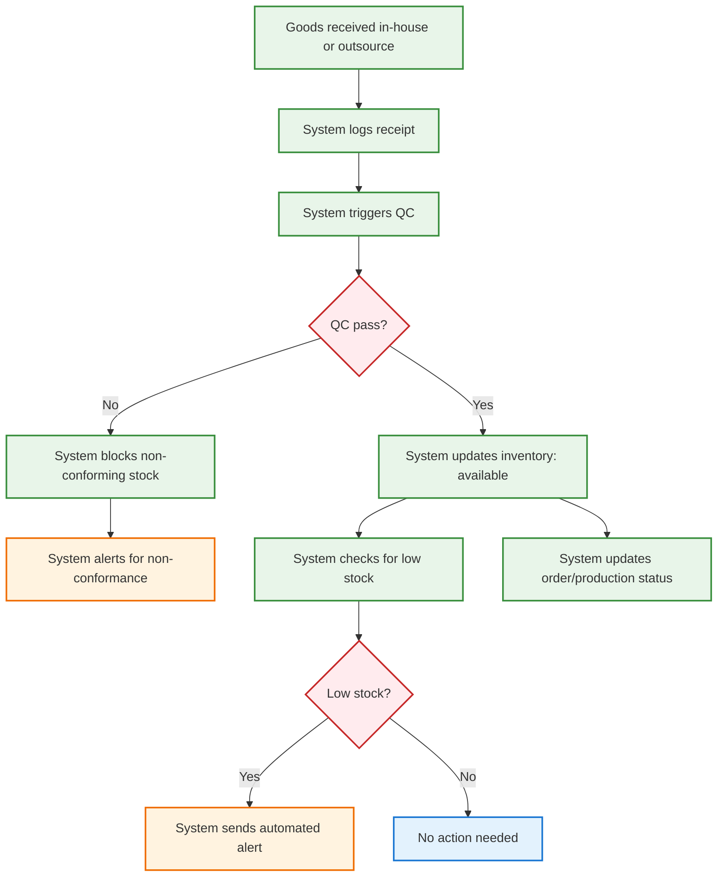

# Business Flow: Inventory & Quality Management (Mermaid)

---

## Key Automation Points
- Goods receipt, QC, and inventory update are automated
- Non-conforming stock is blocked and alerts triggered
- Low stock alerts are automatic
- Order/production status updated in real time
