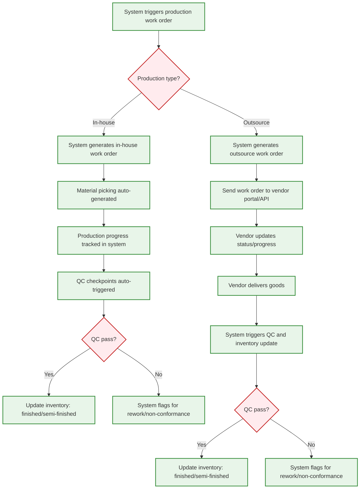

# Business Flow: Production Execution (Mermaid)

---

## Key Automation Points
- Work orders, material picking, and QC are system-driven
- Vendor collaboration and status updates are digital
- Inventory and QC updates are automated
- Exception handling for rework/non-conformance
