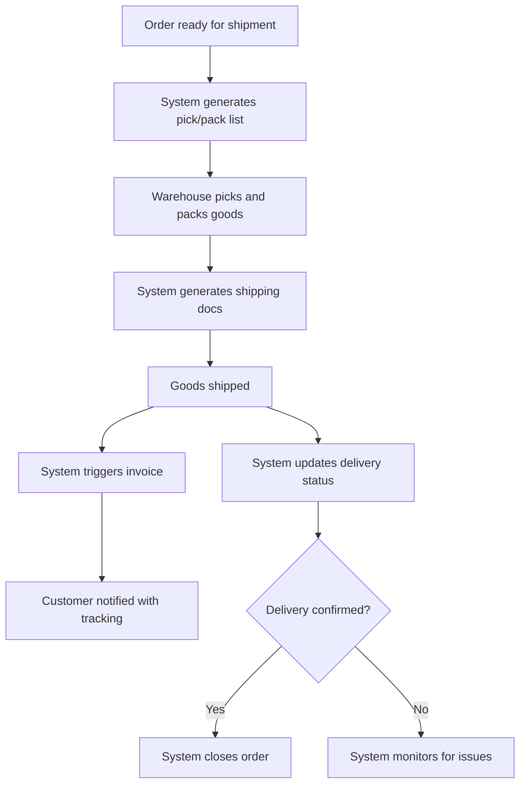

# Business Flow: Shipping & Invoicing (Mermaid)

---

## Key Automation Points
- Pick/pack lists and shipping docs are system-generated
- Invoice triggered automatically on shipment/delivery
- Customer notification and delivery status tracking are automated
- Exception handling for delivery issues
