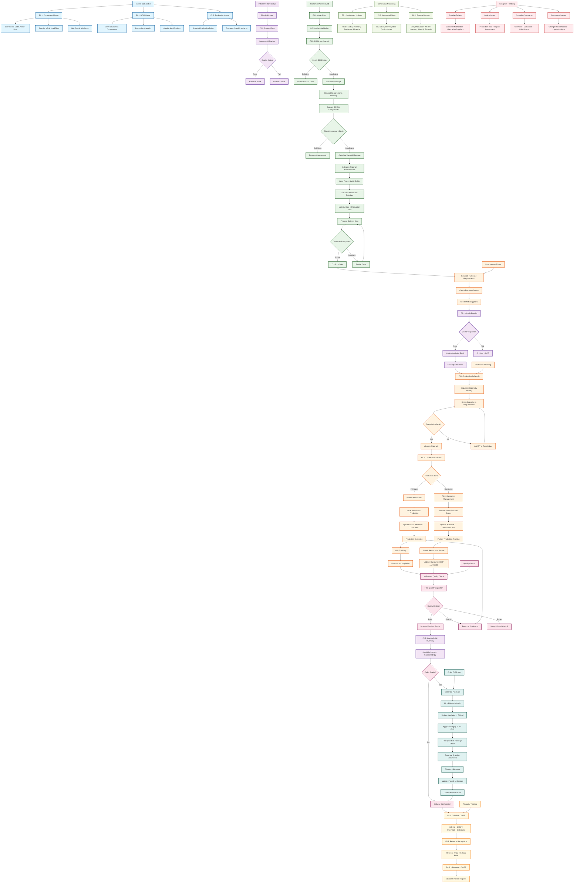
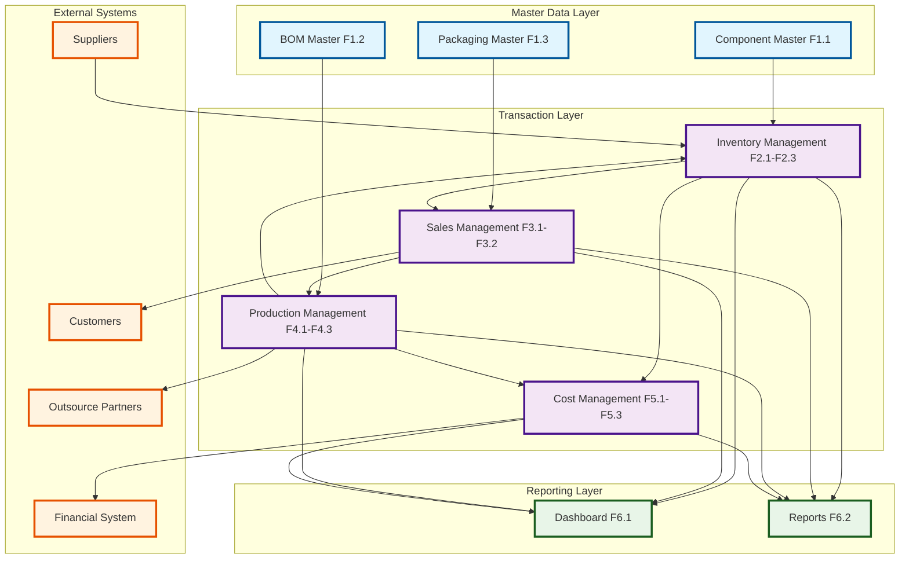

# PO Requirement: Mermaid Flowchart

## Complete Business Process Flow - Mermaid Diagram

```mermaid
graph TD
    %% PHASE 1: MASTER DATA SETUP
    A[Master Data Setup] --> A1[F1.1: Component Master]
    A --> A2[F1.2: BOM Master]
    A --> A3[F1.3: Packaging Master]
    
    A1 --> A1a[Component Code, Name, UoM]
    A1 --> A1b[Supplier Info & Lead Time]
    A1 --> A1c[Unit Cost & Min Stock]
    
    A2 --> A2a[BOM Structure & Components]
    A2 --> A2b[Production Capacity]
    A2 --> A2c[Quality Specifications]
    
    A3 --> A3a[Standard Packaging Rules]
    A3 --> A3b[Customer-Specific Variants]
    
    %% PHASE 2: INITIAL INVENTORY
    B[Initial Inventory Setup] --> B1[Physical Count]
    B1 --> B2[F2.1: System Entry]
    B2 --> B3[Inventory Validation]
    B3 --> B4{Quality Status}
    B4 -->|Pass| B4a[Available Stock]
    B4 -->|Fail| B4b[On-Hold Stock]
    
    %% PHASE 3: CUSTOMER ORDER
    C[Customer PO Received] --> C1[F3.1: Order Entry]
    C1 --> C1a[PO Details & Validation]
    C1a --> C2[F3.2: Fulfillment Analysis]
    
    C2 --> C2a{Check BOM Stock}
    C2a -->|Sufficient| C2b[Reserve Stock → G7]
    C2a -->|Insufficient| C2c[Calculate Shortage]
    
    C2c --> C3[Material Requirements Planning]
    C3 --> C3a[Explode BOM to Components]
    C3a --> C3b{Check Component Stock}
    C3b -->|Sufficient| C3c[Reserve Components]
    C3b -->|Insufficient| C3d[Calculate Material Shortage]
    
    C3d --> C4[Calculate Material Available Date]
    C4 --> C4a[Lead Time + Safety Buffer]
    C4a --> C5[Calculate Production Schedule]
    C5 --> C5a[Material Date + Production Time]
    C5a --> C6[Propose Delivery Date]
    C6 --> C6a{Customer Acceptance}
    C6a -->|Accept| C6b[Confirm Order]
    C6a -->|Negotiate| C6c[Revise Dates]
    C6c --> C6
    C6b --> D1
    
    %% PHASE 4: PROCUREMENT
    D[Procurement Phase] --> D1[Generate Purchase Requirements]
    D1 --> D2[Create Purchase Orders]
    D2 --> D3[Send PO to Suppliers]
    D3 --> D4[F2.1: Goods Receipt]
    D4 --> D5{Quality Inspection}
    D5 -->|Pass| D5a[Update Available Stock]
    D5 -->|Fail| D5b[On-Hold + NCR]
    D5a --> D6[F2.3: Update Alerts]
    D6 --> E1
    
    %% PHASE 5: PRODUCTION PLANNING
    E[Production Planning] --> E1[F4.1: Production Schedule]
    E1 --> E1a[Sequence Orders by Priority]
    E1a --> E1b[Check Capacity vs Requirements]
    E1b --> E1c{Capacity Available?}
    E1c -->|Yes| E1d[Allocate Materials]
    E1c -->|No| E1e[Add OT or Reschedule]
    E1e --> E1b
    E1d --> E2[F4.2: Create Work Orders]
    
    E2 --> E3{Production Type}
    E3 -->|In-House| E4[Internal Production]
    E3 -->|Outsource| E5[F4.3: Outsource Management]
    
    %% IN-HOUSE PRODUCTION
    E4 --> E4a[Issue Materials to Production]
    E4a --> E4b[Update Stock: Reserved → Consumed]
    E4b --> E4c[Production Execution]
    E4c --> E4d[WIP Tracking]
    E4d --> E4e[Production Completion]
    E4e --> F1
    
    %% OUTSOURCE PRODUCTION
    E5 --> E5a[Transfer Semi-Finished Goods]
    E5a --> E5b[Update: Available → Outsourced WIP]
    E5b --> E5c[Partner Production Tracking]
    E5c --> E5d[Goods Return from Partner]
    E5d --> E5e[Update: Outsourced WIP → Available]
    E5e --> F1
    
    %% PHASE 6: QUALITY CONTROL
    F[Quality Control] --> F1[In-Process Quality Check]
    F1 --> F2[Final Quality Inspection]
    F2 --> F3{Quality Decision}
    F3 -->|Pass| F4[Move to Finished Goods]
    F3 -->|Rework| F5[Return to Production]
    F3 -->|Scrap| F6[Scrap & Cost Write-off]
    F5 --> E4c
    
    F4 --> F7[F2.2: Update BOM Inventory]
    F7 --> F8[Available Stock += Completed Qty]
    F8 --> F9{Order Ready?}
    F9 -->|Yes| G1
    F9 -->|No| G10[Wait for More Production]
    
    %% PHASE 7: ORDER FULFILLMENT
    G[Order Fulfillment] --> G1[Generate Pick Lists]
    G1 --> G2[Pick Finished Goods]
    G2 --> G3[Update: Available → Picked]
    G3 --> G4[Apply Packaging Rules F1.3]
    G4 --> G5[Final Quality & Package Check]
    G5 --> G6[Generate Shipping Documents]
    G6 --> G7[Dispatch Shipment]
    G7 --> G8[Update: Picked → Shipped]
    G8 --> G9[Customer Notification]
    G9 --> G10[Delivery Confirmation]
    G10 --> H1
    
    %% PHASE 8: FINANCIAL TRACKING
    H[Financial Tracking] --> H1[F5.1: Calculate COGS]
    H1 --> H1a[Material + Labor + Overhead + Outsource]
    H1a --> H2[F5.3: Revenue Recognition]
    H2 --> H2a[Revenue = Qty × Selling Price]
    H2a --> H3[Profit = Revenue - COGS]
    H3 --> H4[Update Financial Reports]
    
    %% CONTINUOUS MONITORING
    I[Continuous Monitoring] --> I1[F6.1: Dashboard Updates]
    I --> I2[F2.3: Automated Alerts]
    I --> I3[F6.2: Regular Reports]
    
    I1 --> I1a[Order Status, Inventory, Production, Financial]
    I2 --> I2a[Low Stock, Delivery Risk, Quality Issues]
    I3 --> I3a[Daily Production, Weekly Inventory, Monthly Financial]
    
    %% EXCEPTION HANDLING
    J[Exception Handling] --> J1[Supplier Delays]
    J --> J2[Quality Issues]
    J --> J3[Capacity Constraints]
    J --> J4[Customer Changes]
    
    J1 --> J1a[Customer Notification + Alternative Suppliers]
    J2 --> J2a[Production Hold + Impact Assessment]
    J3 --> J3a[Overtime + Outsource + Prioritization]
    J4 --> J4a[Change Order Process + Impact Analysis]
    
    %% STYLING
    classDef masterData fill:#e1f5fe,stroke:#01579b,stroke-width:2px
    classDef inventory fill:#f3e5f5,stroke:#4a148c,stroke-width:2px
    classDef sales fill:#e8f5e8,stroke:#1b5e20,stroke-width:2px
    classDef production fill:#fff3e0,stroke:#e65100,stroke-width:2px
    classDef quality fill:#fce4ec,stroke:#880e4f,stroke-width:2px
    classDef fulfillment fill:#e0f2f1,stroke:#004d40,stroke-width:2px
    classDef financial fill:#fff8e1,stroke:#f57f17,stroke-width:2px
    classDef monitoring fill:#f1f8e9,stroke:#33691e,stroke-width:2px
    classDef exception fill:#ffebee,stroke:#c62828,stroke-width:2px
    
    class A,A1,A2,A3,A1a,A1b,A1c,A2a,A2b,A2c,A3a,A3b masterData
    class B,B1,B2,B3,B4,B4a,B4b,D4,D5,D5a,D5b,D6,F7,F8 inventory
    class C,C1,C1a,C2,C2a,C2b,C2c,C3,C3a,C3b,C3c,C3d,C4,C4a,C5,C5a,C6,C6a,C6b,C6c sales
    class D,D1,D2,D3,E,E1,E1a,E1b,E1c,E1d,E1e,E2,E3,E4,E4a,E4b,E4c,E4d,E4e,E5,E5a,E5b,E5c,E5d,E5e production
    class F,F1,F2,F3,F4,F5,F6,F9,G10 quality
    class G,G1,G2,G3,G4,G5,G6,G7,G8,G9 fulfillment
    class H,H1,H1a,H2,H2a,H3,H4 financial
    class I,I1,I2,I3,I1a,I2a,I3a monitoring
    class J,J1,J2,J3,J4,J1a,J2a,J3a,J4a exception
```

## Simplified High-Level Flow

```mermaid
flowchart LR
    A[Customer Order] --> B[Order Analysis]
    B --> C{Stock Available?}
    C -->|Yes| D[Direct Fulfillment]
    C -->|No| E[Production Planning]
    
    E --> F[Material Check]
    F --> G{Materials Available?}
    G -->|Yes| H[Start Production]
    G -->|No| I[Procurement]
    
    I --> J[Supplier Delivery]
    J --> H
    H --> K[Quality Control]
    K --> L{Quality Pass?}
    L -->|Yes| M[Finished Goods]
    L -->|No| N[Rework/Scrap]
    N --> H
    
    M --> O[Order Fulfillment]
    O --> P[Packaging & Shipping]
    P --> Q[Customer Delivery]
    Q --> R[Revenue Recognition]
    
    D --> O
    
    classDef process fill:#e3f2fd,stroke:#1976d2,stroke-width:2px
    classDef decision fill:#fff3e0,stroke:#f57c00,stroke-width:2px
    classDef endpoint fill:#e8f5e8,stroke:#388e3c,stroke-width:2px
    
    class A,B,E,F,H,I,J,K,M,O,P,Q,R,D,N process
    class C,G,L decision
```

## Critical Path Analysis

```mermaid
gantt
    title ERP Mini System Critical Path
    dateFormat X
    axisFormat %d
    
    section Master Data
    Component Master     :a1, 0, 2
    BOM Master          :a2, 0, 3
    Packaging Master    :a3, 0, 1
    
    section Order Process
    Order Receipt       :b1, 3, 1
    Order Analysis      :b2, after b1, 2
    Material Planning   :b3, after b2, 1
    
    section Procurement
    Purchase Orders     :c1, after b3, 1
    Supplier Delivery   :c2, after c1, 7
    Goods Receipt       :c3, after c2, 1
    
    section Production
    Production Planning :d1, after c3, 1
    Material Issue      :d2, after d1, 1
    Manufacturing       :d3, after d2, 5
    Quality Control     :d4, after d3, 1
    
    section Fulfillment
    Order Picking       :e1, after d4, 1
    Packaging           :e2, after e1, 1
    Shipping            :e3, after e2, 1
    Delivery            :e4, after e3, 3
    
    section Financial
    Cost Calculation    :f1, after d4, 1
    Revenue Recognition :f2, after e4, 1
```

## System Integration Map

```mermaid
graph TB
    subgraph "Master Data Layer"
        MD1[Component Master F1.1]
        MD2[BOM Master F1.2]
        MD3[Packaging Master F1.3]
    end
    
    subgraph "Transaction Layer"
        T1[Inventory Management F2.1-F2.3]
        T2[Sales Management F3.1-F3.2]
        T3[Production Management F4.1-F4.3]
        T4[Cost Management F5.1-F5.3]
    end
    
    subgraph "Reporting Layer"
        R1[Dashboard F6.1]
        R2[Reports F6.2]
    end
    
    subgraph "External Systems"
        E1[Suppliers]
        E2[Customers]
        E3[Outsource Partners]
        E4[Financial System]
    end
    
    MD1 --> T1
    MD2 --> T3
    MD3 --> T2
    
    T1 --> T2
    T2 --> T3
    T3 --> T1
    T1 --> T4
    T3 --> T4
    
    T1 --> R1
    T2 --> R1
    T3 --> R1
    T4 --> R1
    
    T1 --> R2
    T2 --> R2
    T3 --> R2
    T4 --> R2
    
    E1 --> T1
    T2 --> E2
    T3 --> E3
    T4 --> E4
    
    classDef master fill:#e1f5fe,stroke:#01579b,stroke-width:3px
    classDef transaction fill:#f3e5f5,stroke:#4a148c,stroke-width:3px
    classDef reporting fill:#e8f5e8,stroke:#1b5e20,stroke-width:3px
    classDef external fill:#fff3e0,stroke:#e65100,stroke-width:3px
    
    class MD1,MD2,MD3 master
    class T1,T2,T3,T4 transaction
    class R1,R2 reporting
    class E1,E2,E3,E4 external
```