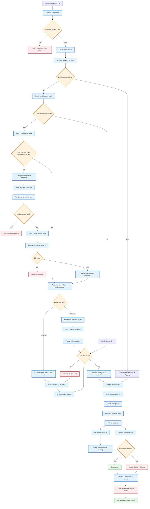
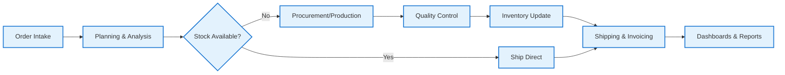

# Integrated End-to-End Business Flow (Mermaid)

This diagram shows how all business processes work together in the automated ERP system.

## Complete Order-to-Delivery Flow

---

## Simplified High-Level View

---

## Key Integration Points

1. **Order → Planning:** Automatic trigger when order is validated
2. **Planning → Procurement:** Automatic RFQ/PO generation if shortage
3. **Procurement → Production:** Components flow directly to production plan
4. **Production → QC → Inventory:** Seamless status and stock updates
5. **Inventory → Shipping:** Automatic fulfillment check and pick/pack
6. **Shipping → Finance:** Auto-invoice on shipment/delivery
7. **All Phases → Dashboards:** Real-time data feeds and alerts

---

## Automation Benefits

- **Zero Manual Handoffs:** System manages all transitions
- **Exception-Based Management:** Users only handle approvals, escalations, issues
- **Real-Time Visibility:** Every stakeholder sees current status
- **Vendor Integration:** Outsource partners are part of the workflow
- **Intelligent Alerts:** Proactive notifications for delays, quality issues, low stock
- **Single Source of Truth:** All data in one centralized system
